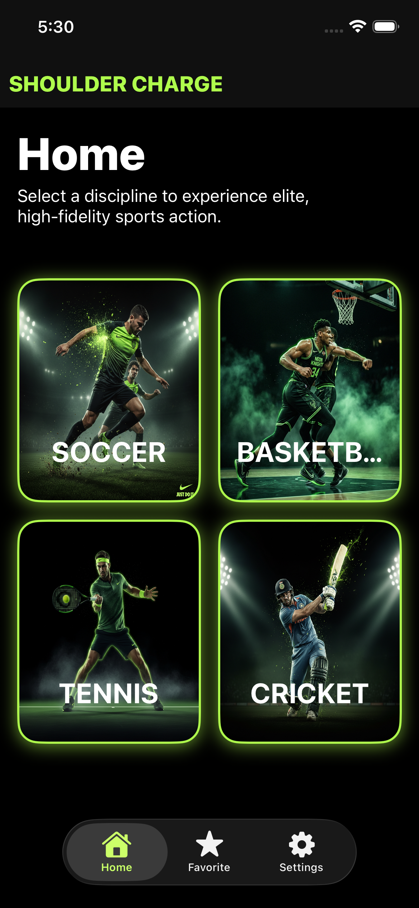
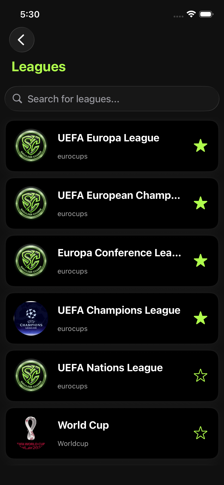
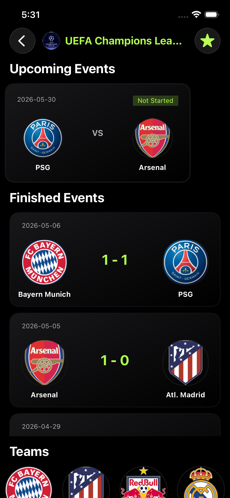
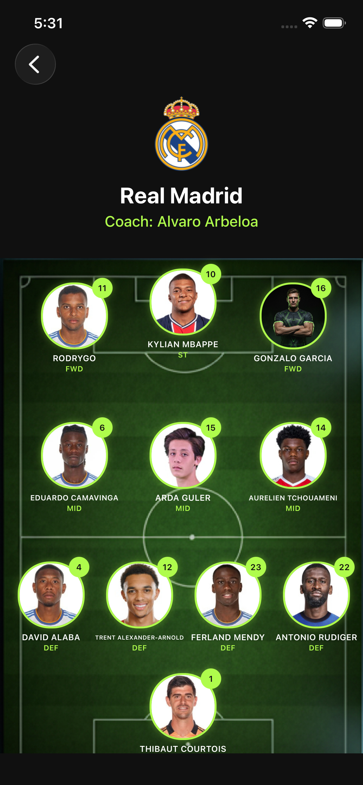
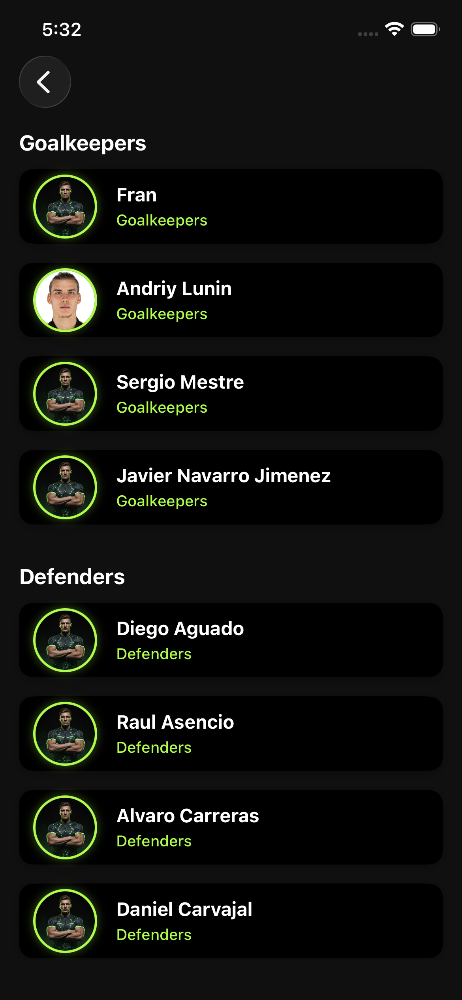
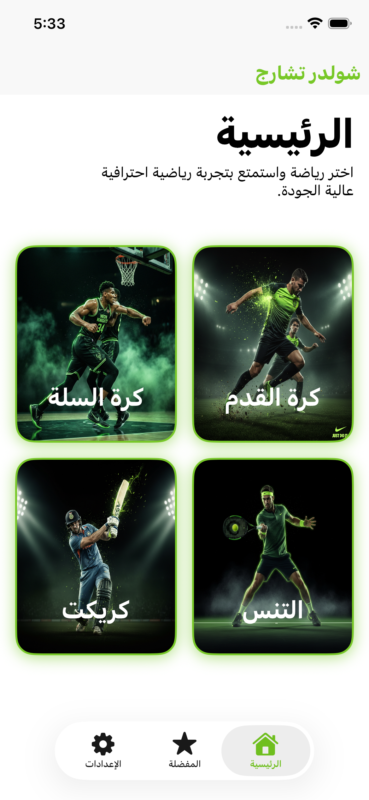
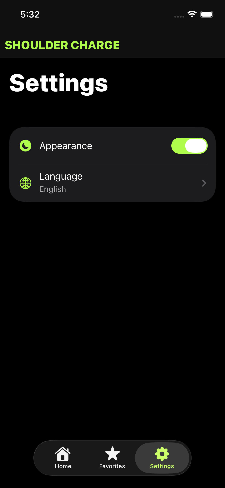
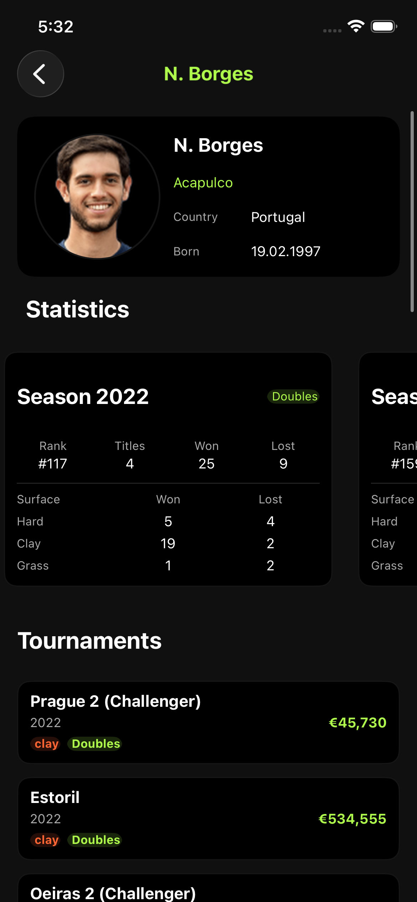
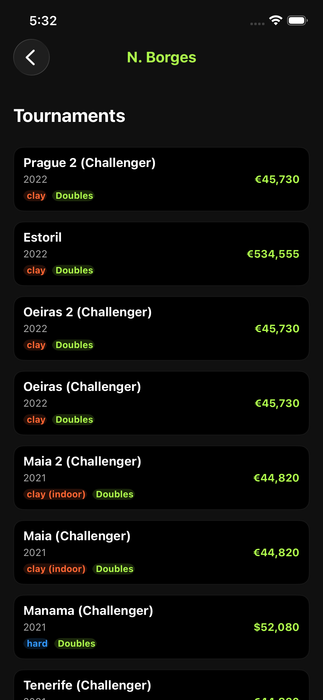
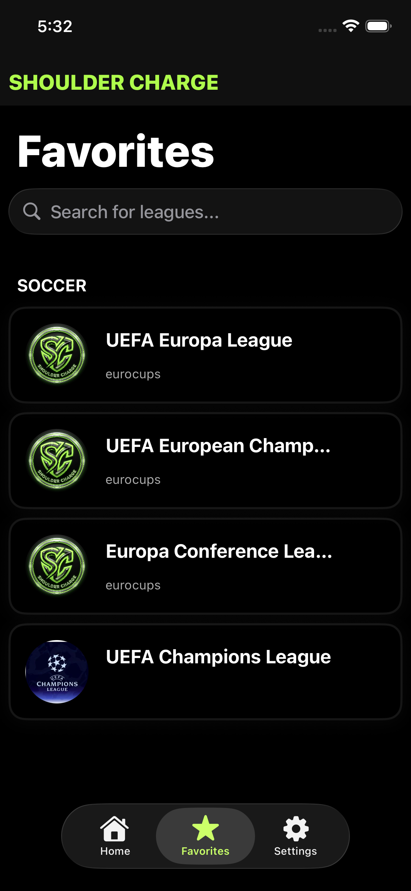

# 🏅 Shoulder Charge

A multi-sport iOS application that lets users browse leagues, view fixtures and past events, explore teams and players, and save their favourite leagues — all in one place.

---

## 📱 Screenshots

| Home | Leagues | League Details |
|:---:|:---:|:---:|
|  |  |  |

| Team Lineup | Squad List |
|:---:|:---:|
|  |  |

| Localisation — AR, Light Mode | Settings |
|:---:|:---:|
|  |  |

| Player Profile | Player Tournaments | Favourites |
|:---:|:---:|:---:|
|  |  |  |

---

## ✨ Features

- **Multi-sport Support** — Browse leagues, fixtures, and participants across **Football**, **Basketball**, **Cricket**, and **Tennis**.
- **League Details** — View upcoming and past events for any league, along with all competing teams or players.
- **Favourites** — Save leagues locally using **Core Data** and access them from a dedicated Favourites tab, even offline.
- **Player & Team Details** — Dedicated screens for individual team and player information.
- **Dark / Light / System Theme** — Full theme switching support with a smooth animated transition.
- **Bilingual (EN / AR)** — Full Arabic and English localisation with runtime language switching and automatic RTL layout support.
- **Network Monitoring** — Uses Alamofire's `NetworkReachabilityManager` to detect connectivity and alert the user when offline.
- **Onboarding** — First-launch onboarding flow with paginated slides.
- **Unit Tests** — Comprehensive unit tests for networking and data-source layers using a `FakeNetworkClient` mock.

---

## 🏗️ Architecture

The app follows a **Clean Architecture** approach combined with the **MVP (Model-View-Presenter)** pattern, keeping each module self-contained.

```
Modules/
├── Module/
│   ├── Data/
│   │   ├── DTO/             # Decodable API response models
│   │   ├── DataSource/      # API calls via NetworkClient
│   │   └── Repository/      # Concrete repository implementations
│   ├── Domain/
│   │   ├── Entities/        # Business models (e.g. UnifiedLeagueModel)
│   │   └── Repository Interfaces/
│   └── Presentation/
│       ├── Presenter/       # Business logic & state
│       ├── Router/          # Navigation
│       └── Views/           # UIViewControllers & XIBs
```

### Modules

| Module | Description |
|---|---|
| **Splash** | Animated launch screen |
| **Onboarding** | First-launch walkthrough |
| **Home** | Sport-type selector grid |
| **Leagues** | Sport-specific league list |
| **League Details** | Fixtures (past & upcoming) + teams/players tabs |
| **Team Details** | Individual team information |
| **Player Details** | Individual player information |
| **Favourite** | Offline-accessible saved leagues |
| **Settings** | Theme and language preferences |

---

## 🛠️ Tech Stack

| Category | Details |
|---|---|
| **Language** | Swift 6.2 |
| **UI Framework** | UIKit (Storyboards + programmatic) |
| **Minimum iOS** | iOS 26.0 |
| **Architecture** | Clean Architecture + MVP |
| **Networking** | [Alamofire 5.11](https://github.com/Alamofire/Alamofire) |
| **Image Loading** | [SDWebImage 5.17](https://github.com/SDWebImage/SDWebImage) |
| **Localisation** | [Localize-Swift 3.2](https://github.com/marmelroy/Localize-Swift) |
| **Persistence** | Core Data |
| **API** | [AllSportsAPI v2](https://apiv2.allsportsapi.com/) |
| **Testing** | XCTest with a custom `FakeNetworkClient` mock |

---

## 🧪 Testing

Tests live in the `Shoulder-ChargeTests` target and follow the **Given / When / Then** structure.

| Test Suite | What is tested |
|---|---|
| `NetworkClientTests` | Real integration tests — leagues, fixtures, teams, players, and network failures |
| `LeaguesAPIDataSourceTests` | Mocked unit tests for all four sports and the failure path |
| `LeagueDetailsAPIDataSourceTests` | Mocked unit tests for past events, upcoming events, participants (teams & players), and the failure path |

Run all tests with `Cmd + U` in Xcode.

---

## 📦 Installation

1. **Clone the repository**
   ```bash
   git clone <repo-url>
   cd Shoulder-Charge
   ```

2. **Resolve Swift Package dependencies**
   Open `Shoulder-Charge.xcodeproj` in Xcode — packages resolve automatically.

3. **Add your API key (never commit this)**

   Copy the example config file and fill in your own key:
   ```bash
   cp Secrets.xcconfig.example Secrets.xcconfig
   ```
   Then open `Secrets.xcconfig` and replace the placeholder:
   ```
   API_KEY = your_actual_key_here
   ```
   Get a free key at [allsportsapi.com](https://allsportsapi.com/).

   > ⚠️ `Secrets.xcconfig` is listed in `.gitignore` — it will never be committed.

4. **Wire the config to Xcode**

   - Open `Shoulder-Charge.xcodeproj`.
   - Click the **project** (blue icon) → **Info** tab → **Configurations**.
   - For both **Debug** and **Release**, set the `Shoulder-Charge` target to use **`Secrets`**.
   - Clean (`Cmd+Shift+K`) and rebuild.

5. **Run on a simulator or device** (iOS 26.0+).

---

## 🌐 API

Data is fetched from [AllSportsAPI](https://apiv2.allsportsapi.com/).

| Endpoint | Purpose |
|---|---|
| `/{sport}/?met=Leagues` | Fetch all leagues for a sport |
| `/{sport}/?met=Fixtures` | Fetch fixtures for a league |
| `/{sport}/?met=Teams` | Fetch teams in a league |
| `/{sport}/?met=Players` | Fetch players in a tennis league |

Supported sport paths: `football`, `basketball`, `cricket`, `tennis`.

---

## 👥 Authors

| Name | GitHub | LinkedIn |
|---|---|---|
| **Eslam Elnady** | [GitHub](https://github.com/EslamElnady0) | [LinkedIn](https://www.linkedin.com/in/eslam-elnady-58062b25a/) |
| **Ibrahim Siam** | [GitHub](https://github.com/ibrahimsiam25) | [LinkedIn](https://www.linkedin.com/in/ibrahim-siam/) |

---

## 📄 License

This project was built as part of the **ITI (Information Technology Institute)** iOS training programme.
